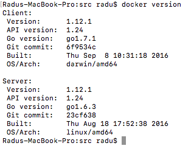
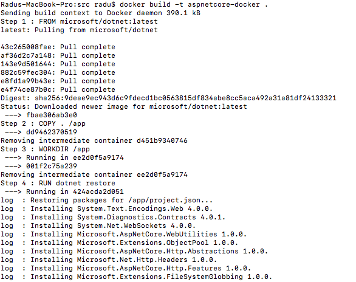
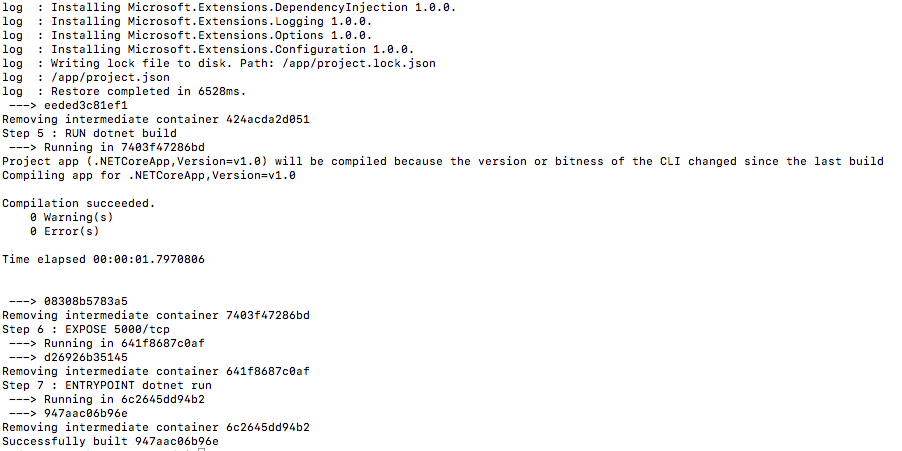
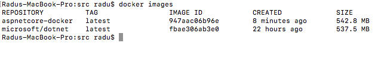
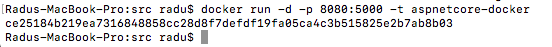
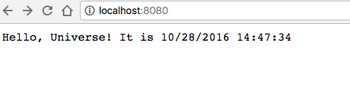

Dockerizing the application
---------------------------

// TODO - introduction

Set up Docker on your machine
------------------------------

The easiest way to install Docker on your machine is to [follow the instructions from the Official Docker Documentation](https://docs.docker.com/engine/installation/).

After you are done, check if the installation was successful by running the `docker version` command:



We will use [the simple web application we built earlier](https://github.com/microsoft-dx/aspnetcore-github-vsts-docker-azure/blob/master/docs/getting-started-with-aspnet-core.md) and we will run it inside a Docker container.

The Dockerfile
---------------

> Docker can build images automatically by reading the instructions from a Dockerfile. A Dockerfile is a text document that contains all the commands a user could call on the command line to assemble an image. Using docker build users can create an automated build that executes several command-line instructions in succession.

Basically, the Dockerfile is like a recipe for building container images. It is a scriptcomposed of multiple commands executed successively to create images based on other images.

We will execute the following operations in our `Dockerfile`:
- pull the official `dotnet` image
- copy the source of the application in the container
- run `dotnet restore` and `dotnet build`
- expose the 5000 port
- set the `dotnet run` command to run when the container starts


To get started, we need to create a new file called `Dockerfile` that does not have an extension, in the root of the application source:

`touch Dockerfile`

The Dockerfile is pretty self-explanatory:

```
FROM microsoft/dotnet:latest
COPY . /app
WORKDIR /app
 
RUN ["dotnet", "restore"]
RUN ["dotnet", "build"]
 
EXPOSE 5000/tcp
ENV ASPNETCORE_URLS http://*:5000
 
ENTRYPOINT ["dotnet", "run"]
```

- it gets a base image that has `dotnet` installed, the `microsoft/dotnet:latest` image
- it copies the source of the application inside the container, in the `/app` folder
- it sets the `/app` folder as the working folder where the commands will be executed from
- executes `dotnet restore` and `dotnet build`
- expoes the 5000 port
- sets the environment variable for ASP .NET Core in the container
- when the container starts it will execute the `dotnet run` command

Basically, it does all the stepts we did when first running the application: we installed .NET Core, then did `dotnet restore`, `dotnet build` and `dotnet run`, just this time everything is done automatically, in a clean (and equivalent) environment every time.

Building the image
------------------

In order to build this image, we simply execute: `docker build -t aspnetcore-docker .` which will build a new image with the `aspnetcore-docker` tag following the instructions in the `Dockerfile` from the current folder (that is what `.` is for).





Normally, this should build a new image we should see by running the `docker images` command:



> Notice how there are two images present: `microsoft/dotnet` and the image we created, `aspnetcore-docker`. That is because our image was build on top of the base image.

> The size of the image is rather large for a Docker image because the `microsoft/dotnet` image contains everything in order to develop, build and run .NET Core applications. If you want the smallest possible image, you should only run the application in the container, hence you should use the image that only contains the runtime - passing an already compiled application.

> [For more information on this, watch this ASP .NET Community Standup](https://www.youtube.com/watch?v=F2YeXBhge3s&list=PL0M0zPgJ3HSftTAAHttA3JQU4vOjXFquF)

Running a new container
------------------------

Now that we built our image it's time to run a container based on that image:

`docker run -d -p 8080:5000 -t aspnetcore-docker`



This started our container, so the Docker should have executed `dotnet run` (remember the last line in the `Dockerfile`) inside our container, so our application should have started. 

Notice the `-p 8080:5000` argument: this maps the port 5000 from the container to port 8080 in the host - this means that if we navigate to `http://localhost:8080`, the application should be running:


