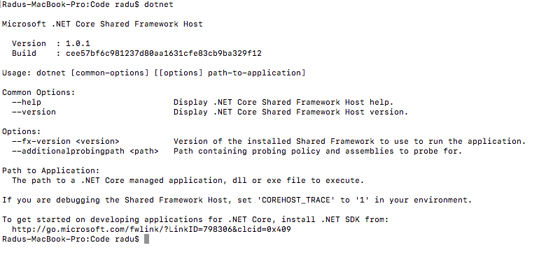
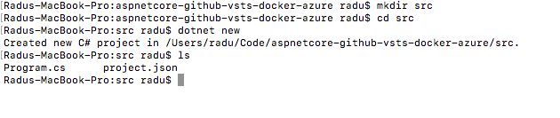
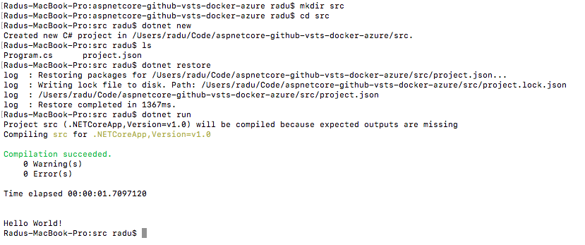
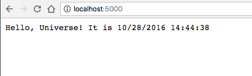

Get started with ASP .NET Core on your system
----------------------------------------------

The first thing you need is to install ASP .NET on your machine. You can do this [by going to the Microsoft website](https://www.microsoft.com/net/core) and select the installation method according to your platform: Windows, macOS or Linux.

In order to verify the installation, you can run the `dotnet` command in your environment of choice (it can be Bash on Windows, or CMD, or PowerShell on macOS, Linux or Windows, or any other termninal).



After this, you can get started with ASP .NET Core [by following the tutorials on our GitHub page.](https://github.com/microsoft-dx/aspnet-core-fundamentals) Here you can find a few articles on creating very simple applications, on configurations, using dependency injection and creating APIs using ASP .NET Core.

Building a very simple web application
---------------------------------------
At this point, we can start building a web application using ASP .NET Core. Since we only want to showcase the integration between various services, we will build a very simple application (that will hopefully be updated over time).

At first, we will only build an application that will respond with `Hello, Universe!` to all incoming requests. Not impressive, but it will work for now.

We will initialize a new `dotnet` application using the `dotnet new` command (preferably in a clean directory):



This command created two files: 
- `Program.cs` - file that contains the `Main` method, the entry point in the application
- `project.json` - file that defines project metadata, compilation information and dependencies

> For more information about `project.json` you can [read the official .NET Core Documentation](https://docs.microsoft.com/en-us/dotnet/articles/core/tools/project-json).

Without looking at the code in `Program.cs`, we can execute `dotnet restore`, to restore the dependencies and `dotnet run` to run the application:


This is just a console application that writes a simple message to the console. In order to make it a web application, first we need a web server. We will use the Kestrel web server, and we will add a dependency to the latest version, `1.0.1` in `project.json`:

`"Microsoft.AspNetCore.Server.Kestrel": "1.0.1"`

After adding the dependency for the web server, we can write the code to respond to requests. This is how the `Main`  method should look like:

```
    public static void Main(string[] args)
    {
        var host = new WebHostBuilder()
            .UseKestrel()
            .Configure(app => app.Run(context =>
            {
                var response = $"Hello, Universe! It is {DateTime.Now} ";
                return context.Response.WriteAsync(response);
            }))
            .Build();

        host.Run();
    }
```

Note that you should also include the following `using` statements:
```
using System;
using Microsoft.AspNetCore.Hosting;
using Microsoft.AspNetCore.Builder;
using Microsoft.AspNetCore.Http;
```

Running the application with `dotnet run` and navigating to `http://localhost:5000`, you should see an output similar to:



This is starting point for the application we are going to use in order to get through the whole process: GitHub --> VSTS --> Docker Hub --> Docker Cloud --> Azure.

At this point, this application only runs inside the .NET Core Framework that we installed on the machine. 

[Next, we will run the same application inside Docker.](dockerizing-the-application.md)
