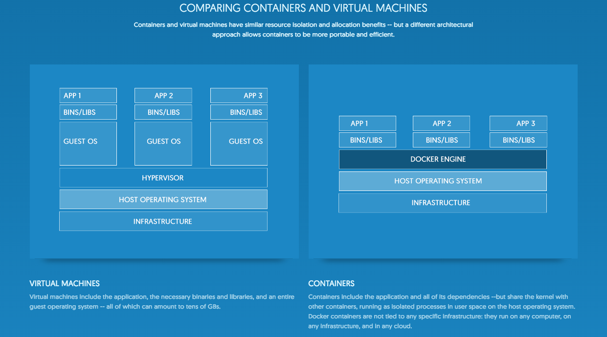

What is Docker?
---------------

> Docker provides a way to run applications securely isolated in a container, packaged with all its dependencies and libraries. Because your application can always be run with the environment it expects right in the build image, testing and deployment is simpler than ever, as your build will be fully portable and ready to run as designed in any environment. And because containers are lightweight and run without the extra load of a hypervisor, you can run many applications that all rely on different libraries and environments on a single kernel, each one never interfering with the other. This allows you to get more out of your hardware by shifting the “unit of scale” for your application from a virtual or physical machine, to a container instance.

> [More on the Official Docker Documentation.](https://docs.docker.com/)

Docker containers wrap up a piece of software in a complete filesystem that contains everything it needs to run: code, runtime, system tools, system libraries - anything you can install on a server. This guarantees that it will always run the same, regardless of the environment it is running in.

Each **virtual machine** includes the application, the necessary binaries and libraries and an entire guest operating system - all of which may be tens of GBs in size.

By contrast, **containers** include the application and all of its dependencies, but share the kernel with other containers. They run as an isolated process in userspace on the host operating system. They're also not tied to any specific infrastructure - Docker containers run on any computer, on any infrastructure and in **any cloud**.

Why use Docker to build applications?
-------------------------------------
There are several good reasons to consider Docker:

- **Consistent Environments**. By packaging up the application with its configs and dependencies together and shipping as a container, the application will always work as designed locally, on another machine, in test or production. No more worries about having to install the same configs into a different environment.
- **Small Footprint**. As explained above, sharing a kernel and filesystem layering makes for very small containers.
- **Continuous Delivery**. Your Continous Integration and Continous Delivery solution - for instance [Visual Studio Team Services](https://www.visualstudio.com/team-services/), [Team Foundation Server](https://www.visualstudio.com/en-us/products/tfs-overview-vs.aspx) or [Jenkins](http://jenkins-ci.org/) - can be easily configured to use Docker containers to automatically build, deploy and test apps. So you can get a fully automated dev / test / production pipeline.
- **Work together**. With [Docker Hub](https://hub.docker.com/) you can create and share your Docker images with other developers. Or you can stand up your private hub for your company to use.

Get started with Docker
-----------------------

There are a lot of resource available to start learning Docker. Here are a few of them:

- [The Official Docker Documentation](https://docs.docker.com/) - as always, the first place
- [Great Pluralsight collection of courses by Nigel Poulton](https://www.pluralsight.com/paths/docker)

How will we use Docker? - //TO DO
-----------------------